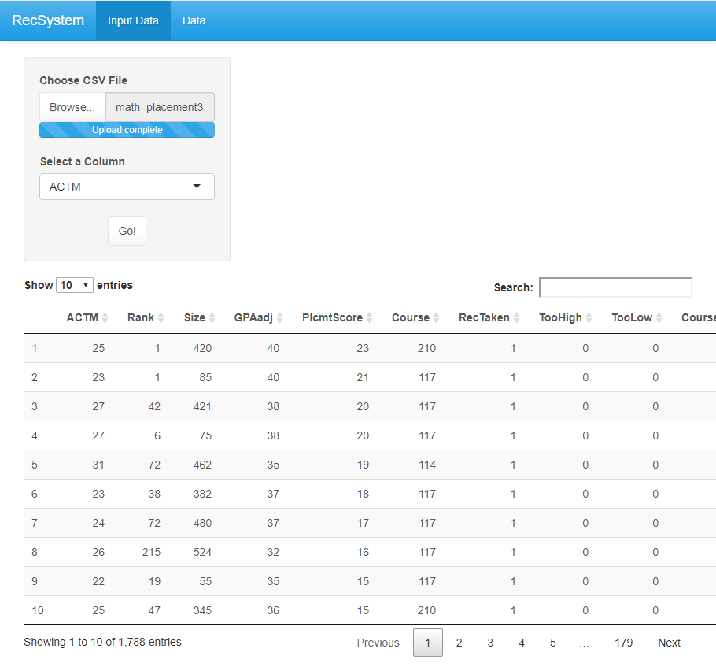

<!-- README.md is generated from README.Rmd. Please edit that file -->

# recSystem

# Overview

This package extracts meta features from a dataset to recommend what
machine learning algorithm will perform the best without running all the
implemented machine learning algorithms. The current selection of
algorithms is limited to support vector machines, naiive bayes
classifier and k nearest neighbors. The metric recall is used to give
the recommended classifier. The meta learner utilizes support vector
regression with a radial basis function kernel to predict the
recommended algorithm.

  - Additionally, this package cleans the data in the following manner:
      - drop columns that have the exact same input for each row
      - drop rows that have NA’s
      - drop object columns that have all unique values
      - one hot encoding for categorical variables
      - normalize continuous columns
      - label encode response

<!-- badges: start -->

<!-- badges: end -->

## Installation

In order to install this package, Python 3.7 must be install.
Additionallay, numpy 1.17.4, pandas 0.25.1, and sci-kit learn 0.21.3 are
required python packages.

You can install the the development version from
[GitHub](https://github.com/) with:

``` r
# install.packages("devtools")
devtools::install_github("clarencew0083/recSystem", INSTALL_opts=c("--no-multiarch"), build_vignettes = TRUE)

```

Once the package is installed, load and attach it using:

``` r
library(recSystem)
#> Loading required package: reticulate
## basic example code
```

When the reticulate package is loaded, a message to download and install
miniconda may appear. Select no.

## Example

You can launch the shiny app using

``` r
recSystem::run_my_app("recSystemApp")
```

When lauching the app the following screen will appear:



  - Click the browse button to upload a csv file.
  - Once the file is uploaded it will be displayed on the screen.
  - Select the target column using the drop-down
  - Click Go\! to get the recommended classification algorithm for your
    chosen dataset


  - The recommended classfication algorithm is displayed in bold
  - Click the download button to download the cleaned dataset if desired

## Console Example

You can launch the recommend function from the console using

``` r
recSystem::recommend()
```

In this case, choose a csv file using the file explorer and type in the
name of the target column.

## Testing

  - Two datasets are included in this package
      - math\_placement.csv - response: courseSuccess
      - urine.csv - response: r

View documentaion of recommend function for an example.

Any dataset with a categorical response should work as well.

Alternatively, use the function recommend2 to use the presupplied
datasets

``` r
out<- recommend2(math_placement, "CourseSuccess")
View(out[[1]])
print(out[[2]])
```

This documentation is also available using

``` r
vignette('recSystem')
```
